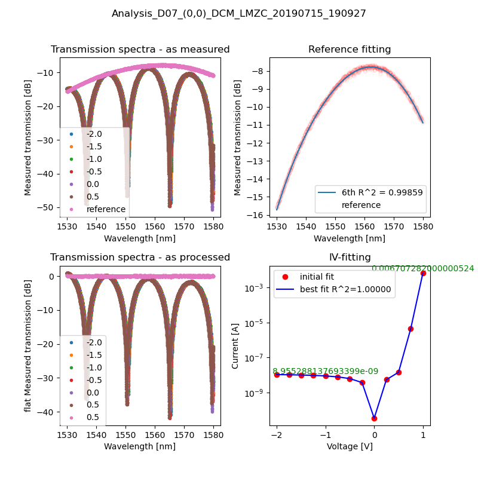
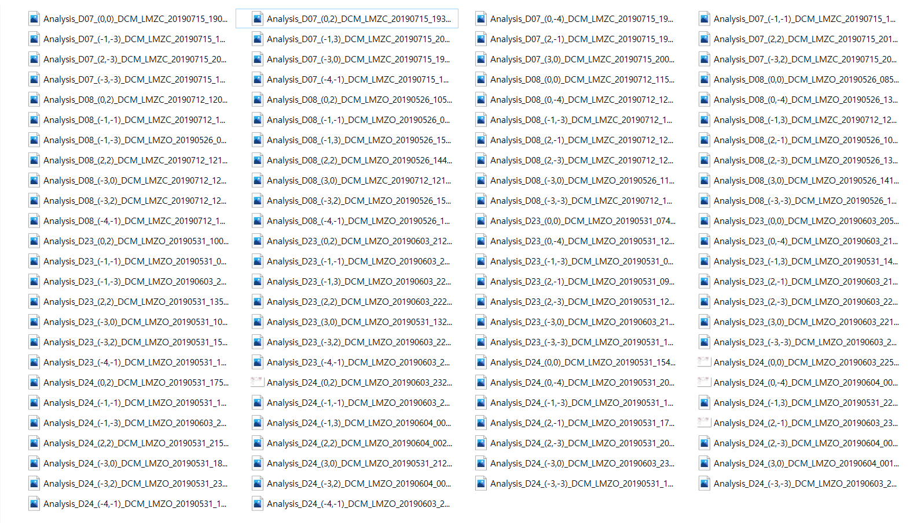
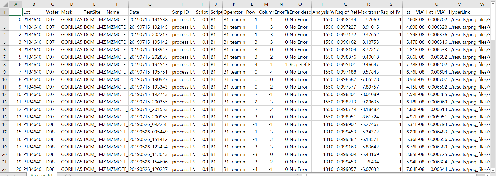

# <u>manual</u>

## __Introduction__

+ The Program Engineering 2 : Team Project to make analysis package to show graphs and Dataframe.

## Objective of project

Analysing the data in xml files and show the contents to <u>csv file</u> and <u>graphs plotting data</u>(_I-V graph, transmission-wavelength graph_)

## Install

``` 
$ pip install -r requirements.txt
```

## Example of analysis Result
+ Merged image(Transmission spectra graph(as measured) & Reference fitting & flat Transmission spectra & IV-fitting)


+ stored Pictures of the merged image


+ analysis contents dataframe by xml data


## run.py: the last move button

python script
