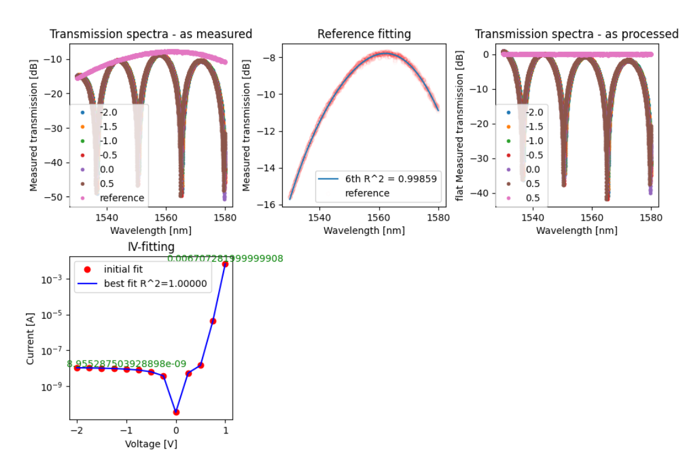
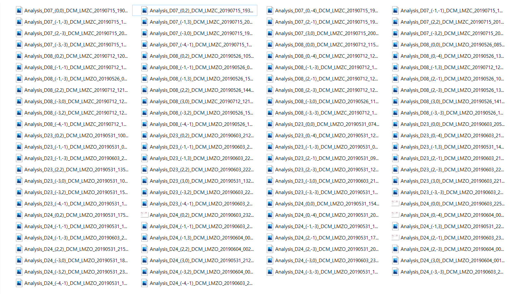
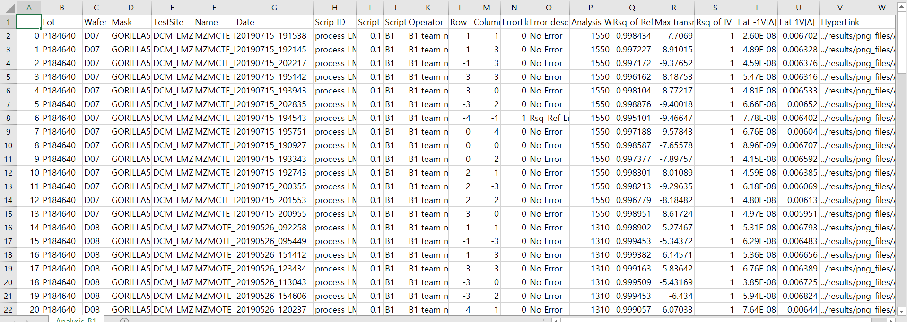

# <u>manual</u>

## __Introduction__

+ The Program Engineering 2 : Team Project to make analysis package
+ Team B1
    * Choi il-gyu
    * Kim Kang Seok
    * Song jun su

## Objective of project

Analysing the data in xml files and show the contents to <u>csv file</u> and <u>graphs plotting data</u>(_I-V graph, transmission-wavelength graph_)

## Structure of Package

+ document : .gitignore and README.md(explaining how to use our package)
+ module 
    - error.py : find the error(out to standard)
    - extract.py : bring the wafer name, experiment date, TestSiteinfo, wavelength
    - filter.py : filter the unuseful xml file
    - fitting.py : fit and show the approximation from IV graph and transmission spectra-wavelngth graph
    - get_result.py : make the dataframe and stored by csv file and images
    - i_none.py : the current value at -1V on IV graph
    - i_one.py : the current value at 1V on IV graph
    - option.py : selective messages to run the package
    - plot.py : plot the graph from extracted data(ex..I-V graph, transmission spectra-wavelength graph)
    - png_signal.py : If there is no png file, we can't make Hyperlink, so we need to know the existence of png files
    - rsq_fit.py : R Square value of Current data and Voltage data
    - rsq_ref.py : R Square value of transmission and 7th wavelength
+ run.py : the last move button

## Example of analysis Result
+ Transmission spectra graph(as measured) & Reference fitting & flat Transmission spectra & IV-fitting

+ Pictures of graphs in xml given by customer

+ Information in xml given by customer using csv file

