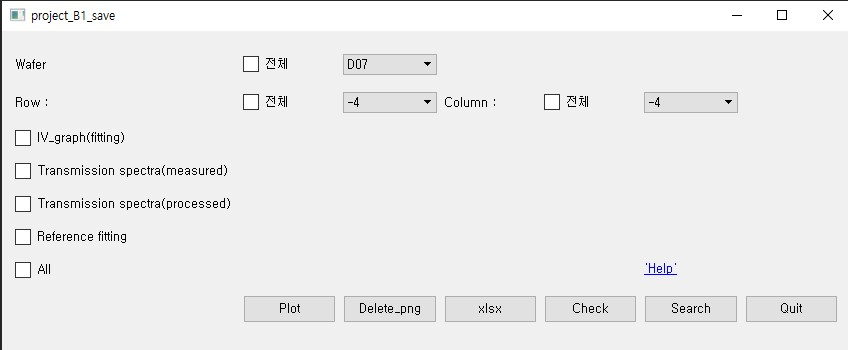

# B1_Project

## Index
[Overview](#Overview)   
[Install](#Install)  
[Environment](#Environment)  
[Enquiry](#Enquiry)  

***

## Install
 ```{.python}
pip install -r requirements.txt
 ```

## Introduction
This tool is analysis package to store analyzed Dataframe and graphs and to show them from xml data customer give.  
1. It consist of "run" / "run_show"   
2. run : store the files in Local Repository  
   run_show : detailed search image  

## Contributor           
* Kim kang-seok         ddol410@hanyang.ac.kr  
* Song jun-su           sb020578@hanyang.ac.kr  
* Choi il-gyu           dlfrb789@hanyang.ac.kr   
## Usage
1. **plot** : You can download all or each part of results
2. **Delete_png** : It deletes all files in results of png
3. **xlsx** : You can download only dataframe file in your local directory
4. **Check** : It shows what you've checked
5. **Search** : Another GUI is opened and you can search a specific iamge, not downloading it
6. **Quit** : Exit
  

## Environment
* Python 3.8
* Window 10

## Enquiry
Please press the 'help' link in window and ask one of us using email.
