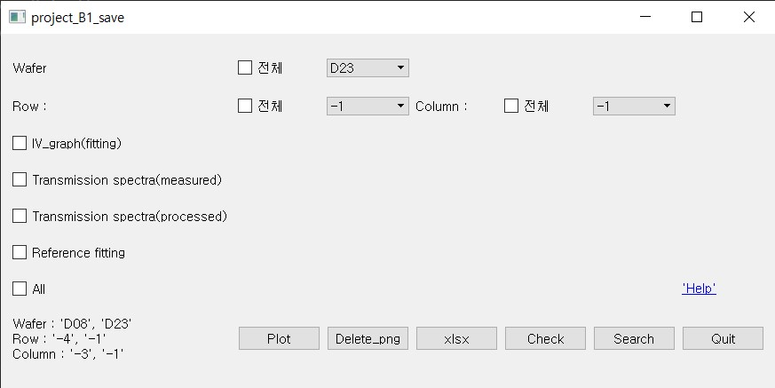

# B1_Project

## Index
[Overview](#Overview)   
[Install](#Install)  
[Environment](#Environment)  
[Enquiry](#Enquiry)  

***

## Introduction
This tool is analysis package to store analyzed Dataframe and graphs and to show them from xml data customer give.  
1. It consist of "run" / "run_show"   
2. run : store the files in Local Repository  
   run_show : detailed search image  

## Contributor           
* Kim kang-seok         ddol410@hanyang.ac.kr  
* Song jun-su           sb020578@hanyang.ac.kr  
* Choi il-gyu           dlfrb789@hanyang.ac.kr   
## Usage
1. **plot** : downloading whether to 
2. **Delete_png** :
3. **xlsx** :
4. **Check** :
5. **Search** :
6. **Quit** : 
  

## Install
 ```{.python}
pip install -r requirements.txt
 ```

## Environment
* Python 3.8
* Window 10

## Enquiry
Please press the 'help' link in window and ask one of us using email.